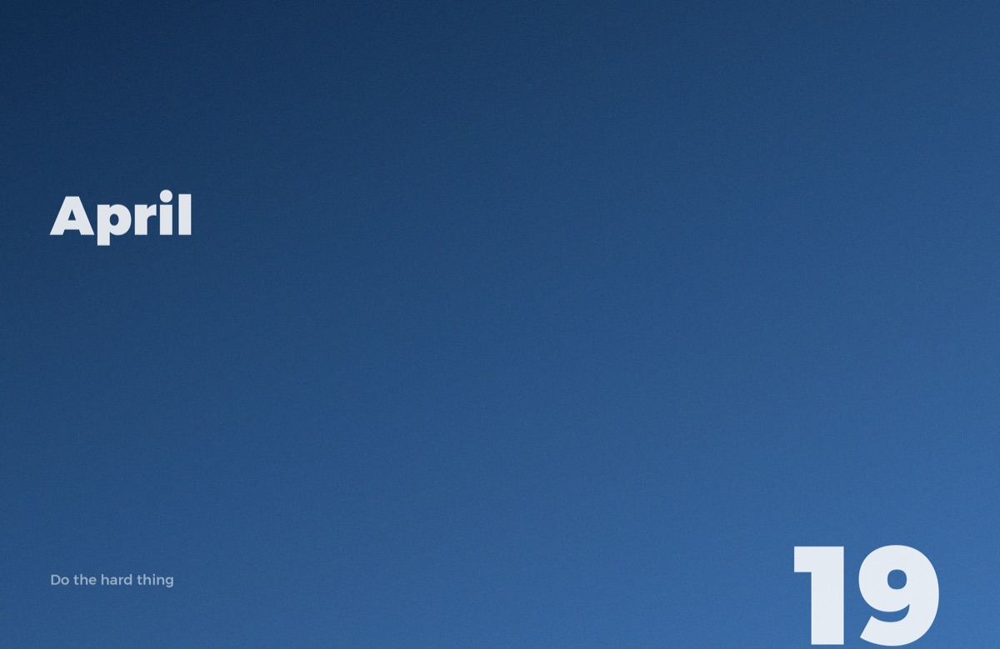

# DailyPaper

A new wallpaper every day. Minimal, textured gradients with the date and a short phrase. Zero CPU. Zero cost.



## Install (macOS)

Open Terminal, paste this, done:

```bash
curl -sL https://raw.githubusercontent.com/Mariusrme/dailypaper/main/install.sh | bash
```

Your wallpaper updates automatically every morning at 7 AM and at every login.

> **Tip:** Go to System Settings → Wallpaper and enable "Show on all Desktops" so it applies to all your Spaces.

## How it works

1. A GitHub Action runs daily and generates a wallpaper image (Python + Pillow)
2. The image is committed to this repo (`output/wallpaper.jpg`)
3. Your Mac fetches it via `launchd` — no background app, no CPU usage
4. The wallpaper is set natively via `desktoppr` or `osascript`

## Uninstall

```bash
bash ~/.dailypaper/uninstall.sh
```

## Stack

- **Python + Pillow + NumPy** — gradient generation with grain texture
- **GitHub Actions** — daily cron, zero infrastructure
- **launchd** — macOS native scheduling
- **Montserrat Arabic** — typography

## License

MIT
